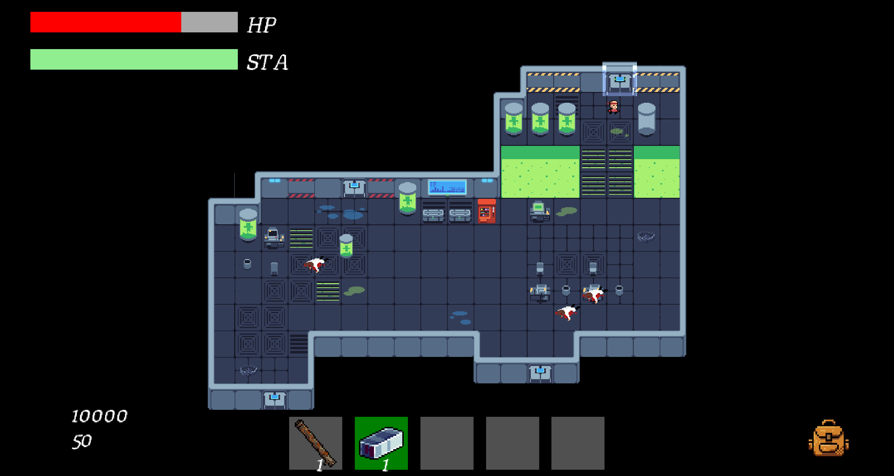
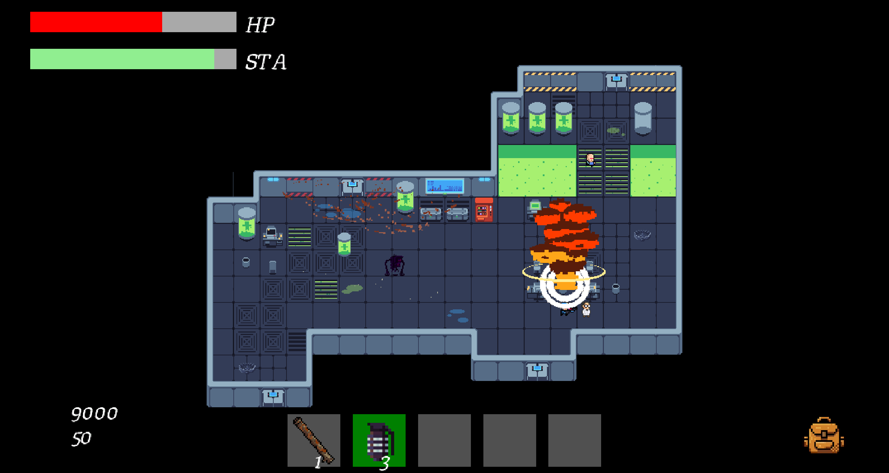
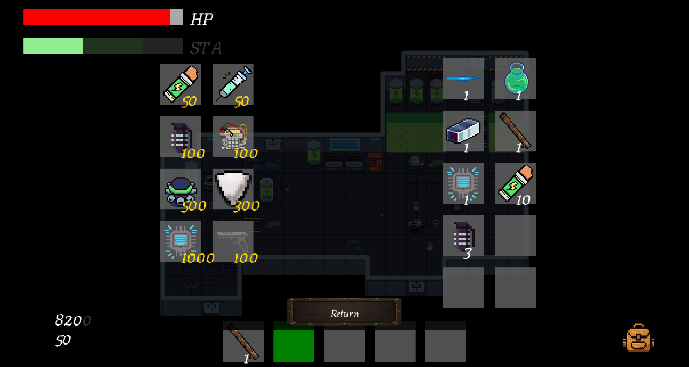

# Genesis

A top-down 2D roguelike built from scratch in C# with a custom Entity-Component-System architecture on top of MonoGame.

You wake up as a test subject in the lowest level of the Helix Biotech research facility. Fight, loot and claw your way up through procedurally arranged floors — die, and you start over from the bottom. Beat the CEO on the top floor and you escape.

<p align="center">
  
  
  
  
</p>

## Features

- **Procedural level layouts** stitched together from hand-authored [Tiled](https://www.mapeditor.org/) rooms, with room and floor transitions
- **Custom ECS** ([Arch](https://github.com/genaray/Arch)) driving movement, combat, AI, physics and rendering as independent systems
- **Roguelike run loop** — permadeath, persistent meta-progression between runs, unlockable achievements
- **Combat & items** — melee/ranged weapons, equipment, an inventory, hazards (acid, traps, chemical tanks), a shop/purchase system
- **A companion creature** that follows and assists the player
- **In-run tutorial** that introduces mechanics contextually instead of a wall of text upfront
- Save/load system, settings, audio mixing, screen shake, dynamic lighting

## Tech stack

- [.NET 8](https://dotnet.microsoft.com/) / C#
- [MonoGame](https://www.monogame.net/) + [MonoGame.Extended](https://www.monogameextended.net/)
- [Arch](https://github.com/genaray/Arch) — archetype-based ECS
- [TiledSharp](https://github.com/marshallward/TiledSharp) — Tiled map loading
- [ImGui.NET](https://github.com/ImGuiNET/ImGui.NET) — in-game debug overlay

## Play it

Grab the latest build from the [Releases](../../releases) page — it's a self-contained Windows build, no .NET SDK or IDE required. Unzip and run `Genesis.exe`.

## Build from source

```bash
git clone https://github.com/<your-username>/Genesis.git
cd Genesis/src/Genesis/Genesis
dotnet run
```

Requires the [.NET 8 SDK](https://dotnet.microsoft.com/download). Content is built automatically via the MonoGame Content Pipeline on first build.

## Background

Genesis started as a semester-long project for a university software engineering practical, built by a team over one semester following a Scrum-based process (sprints, code review, CI). This repository contains only the game's source code.
